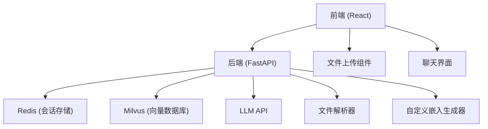
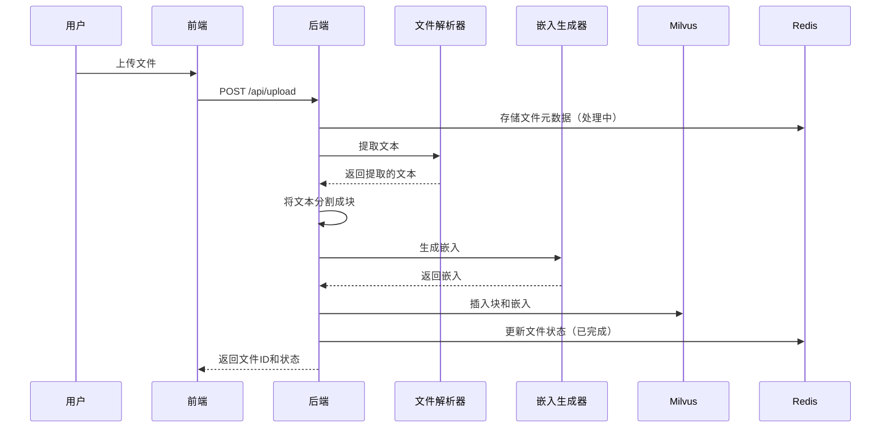
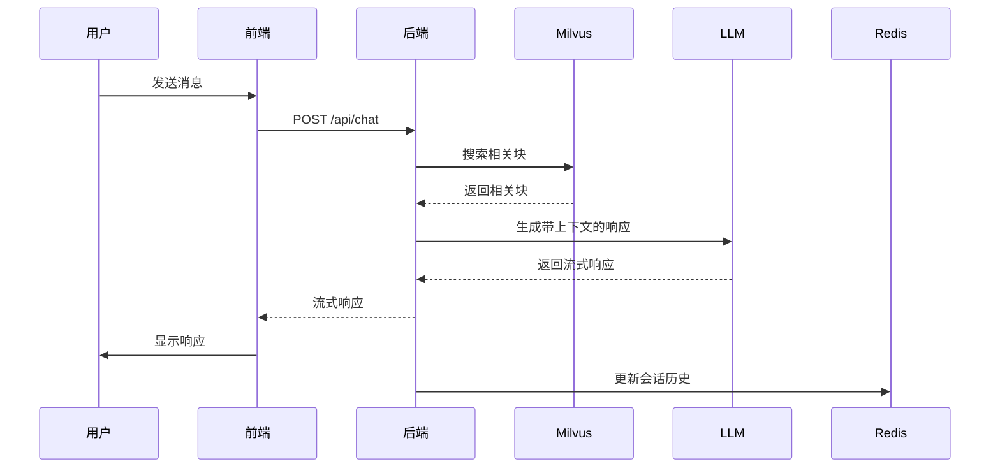

# RAGW 系统文档

## 1. 系统概述

RAGW（Retrieval-Augmented Generation Web）是一个先进的AI聊天系统，结合了文档检索与大型语言模型（LLM）能力，能够基于上传的文档提供上下文感知的响应。该系统允许用户上传各种文件格式，这些文件会被处理、索引，并用于增强LLM的响应，使其包含相关信息。

### 主要功能
- **文档上传与处理**：支持PDF、DOCX和TXT文件
- **智能检索**：使用向量搜索获取相关内容
- **实时聊天**：使用服务器发送事件（SSE）实现流式响应
- **自动会话管理**：LLM生成的会话名称，便于组织
- **高级Markdown渲染**：支持复杂格式，包括粗体、斜体及其组合
- **文件管理**：轻松上传、查看和删除文件
- **Docker化部署**：易于部署和分享

## 2. 技术架构

### 系统组件


### 技术栈
| 组件 | 技术 | 用途 |
|------|------|------|
| 前端 | React, TypeScript, Vite | 用户界面和交互元素 |
| 后端 | FastAPI, Python 3.10 | API端点和业务逻辑 |
| 会话存储 | Redis | 存储聊天会话和文件元数据 |
| 向量数据库 | Milvus 2.3.0 | 索引和搜索文档嵌入 |
| 文件处理 | pdfplumber, python-docx | 从各种文件格式提取文本 |
| LLM集成 | hello-agents | 连接大型语言模型 |
| 部署 | Docker, Docker Compose | 容器化部署 |

## 3. 核心概念

### 检索增强生成（RAG）
RAGW利用RAG方法，通过从上传的文档中检索相关信息来增强LLM的响应。这确保了响应基于用户的特定上下文，而不仅仅依赖于LLM的训练数据。

### 向量嵌入
系统使用自定义嵌入方法生成文本块的向量表示。这些嵌入捕获语义含义，使Milvus向量数据库能够进行基于相似度的搜索。

### 文本分块
为了处理大型文档并克服Milvus字符串长度限制，系统实现了智能文本分块，将文本分割成可管理的片段，同时通过重叠保留上下文。

### 会话管理
聊天会话存储在Redis中，使用LLM分析对话内容自动生成会话名称。

## 4. 功能模块

### 4.1 文件上传与处理
- **文件接收**：支持PDF、DOCX和TXT格式
- **文本提取**：对每种文件类型使用专门的解析器
- **文本分块**：将文本分割为500个token的块，重叠100个token
- **向量化**：为每个块生成嵌入
- **索引**：在Milvus中存储块和嵌入

### 4.2 聊天界面
- **消息处理**：处理用户输入和LLM响应
- **上下文构建**：基于用户查询检索相关文档块
- **Markdown渲染**：支持复杂格式，包括粗体、斜体及其组合
- **会话管理**：创建和管理带有LLM生成名称的聊天会话

### 4.3 文档管理
- **文件列表显示**：显示所有上传的文件及其状态
- **文件删除**：移除文件和相关的向量数据
- **状态跟踪**：监控文件处理状态

### 4.4 嵌入生成
- **自定义嵌入方法**：使用多哈希策略和统计特征
- **维度减少**：384维向量，实现高效存储和搜索
- **归一化**：确保余弦相似度计算的向量幅度一致

## 5. 操作原理

### 端到端工作流程
1. **文件上传**：用户通过前端上传文档
2. **后台处理**：
   - 从文件中提取文本
   - 文本分块（带重叠）
   - 为每个块生成嵌入
   - 存储在Milvus向量数据库中
3. **聊天交互**：
   - 用户发送查询
   - 系统从Milvus检索相关块
   - LLM基于检索的上下文生成响应
   - 响应流式返回给用户
4. **会话管理**：
   - 创建带有LLM生成名称的新会话
   - 会话历史存储在Redis中

### 关键流程

#### 文件处理流程


#### 聊天流程


## 6. 创新点

### 6.1 高级自定义嵌入方法
**问题**：外部嵌入模型需要大量资源，可能存在依赖问题。

**解决方案**：开发了自定义嵌入方法，具有以下特点：
- 使用多哈希策略（8个不同的SHA-256哈希）获取更丰富的特征表示
- 整合文本统计特征（长度、词汇多样性）
- 生成384维向量，实现高效存储
- 包含向量归一化，确保相似度计算一致

**优势**：
- 无外部模型依赖
- 更快的嵌入生成速度
- 更低的资源需求
- 可针对特定领域定制

### 6.2 智能文本分块
**问题**：Milvus对字符串字段有2048字符限制。

**解决方案**：实现了复杂的分块算法，能够：
- 在保持上下文的同时将文本分割成最佳块
- 使用基于token的分割而非基于字符
- 包含可配置的重叠，以维持块之间的上下文
- 自动处理超过长度限制的块

**优势**：
- 克服Milvus字符串长度限制
- 保持文档上下文的连续性
- 提高检索相关性
- 有效处理大型文档

### 6.3 实时响应流式传输
**问题**：LLM响应可能较慢，导致用户体验不佳。

**解决方案**：实现了服务器发送事件（SSE）进行实时流式传输：
- 生成LLM响应时实时流式传输
- 为用户提供即时反馈
- 减少感知延迟
- 优雅处理长响应

**优势**：
- 改善用户体验
- 更好地处理长响应
- 实时交互感

### 6.4 LLM生成的会话名称
**问题**：用户经常忘记每个聊天会话的内容。

**解决方案**：使用LLM自动生成有意义的会话名称：
- 分析对话内容
- 生成简洁、描述性的名称
- 随着对话发展更新名称
- 在LLM不可用时回退到默认名称

**优势**：
- 更好的会话组织
- 更容易在对话之间导航
- 个性化用户体验

### 6.5 高级Markdown渲染
**问题**：LLM响应通常包含需要正确渲染的Markdown。

**解决方案**：实现了全面的Markdown解析器，能够：
- 支持标准Markdown元素（标题、列表、代码块）
- 处理复杂的格式组合（粗体+斜体）
- 支持嵌套格式
- 在不同浏览器中提供一致的渲染

**优势**：
- 更好地呈现LLM响应
- 支持富文本格式
- 提高可读性

## 7. 安装与设置

### 先决条件
- 安装Docker和Docker Compose
- 最少4GB RAM（推荐8GB+）
- 初始设置需要互联网连接

### 部署步骤
1. **克隆仓库**
   ```bash
   git clone <repository-url>
   cd RAGW
   ```

2. **配置环境**
   - 基于`.env.example`创建`.env`文件
   - 设置适当的API密钥和配置值

3. **构建并启动容器**
   ```bash
   docker-compose up -d --build
   ```

4. **访问应用**
   - 前端：http://localhost:4173
   - 后端API：http://localhost:8000

### 启动的服务
| 服务 | 端口 | 描述 |
|------|------|------|
| frontend | 4173 | React前端应用 |
| backend | 8000 | FastAPI后端API |
| redis | 6379 | 会话存储和缓存 |
| milvus | 19530 | 嵌入向量数据库 |
| etcd | 2379 | Milvus元数据存储 |
| minio | 9000 | Milvus对象存储 |

## 8. 使用指南

### 上传文件
1. 点击右侧边栏的"上传文件"按钮
2. 选择PDF、DOCX或TXT文件
3. 等待处理完成（状态会更新）
4. 上传的文件将显示在文件列表中

### 与系统聊天
1. 开始新对话或选择现有会话
2. 在聊天输入框中输入查询
3. 系统将从上传的文件中检索相关信息
4. 接收LLM的流式响应
5. 查看带有适当样式的格式化Markdown响应

### 管理文件
1. 在右侧边栏查看上传的文件
2. 点击删除按钮移除文件
3. 检查文件处理状态（处理中/已完成/失败）

### 管理会话
1. 在左侧边栏查看现有会话
2. 点击"新聊天"按钮开始新会话
3. 会话会根据对话内容自动命名

## 9. 故障排除

### 常见问题
| 问题 | 可能原因 | 解决方案 |
|------|----------|----------|
| 文件上传失败 | Milvus字符串长度限制 | 系统自动分块文本以克服此限制 |
| LLM无响应 | API密钥问题或网络问题 | 检查API密钥配置和网络连接 |
| 搜索结果不相关 | 嵌入质量 | 自定义嵌入方法可能需要针对特定领域进行调整 |
| Docker端口冲突 | 端口已被占用 | 停止冲突服务或修改docker-compose.yml中的端口映射 |
| 内存问题 | 内存不足 | 增加系统内存或在配置中减小块大小 |

### 错误消息
- **"Collection field dim is 1536, but entities field dim is 384"**：Milvus集合维度不匹配。系统会自动重新创建具有正确维度的集合。
- **"invalid input, length of string exceeds max length"**：文本块过长。系统会自动分割块以适应限制。
- **"cannot import name 'cached_download'"**：Hugging Face Hub依赖问题。系统使用自定义嵌入来避免此问题。

## 10. 未来增强

### 计划功能
1. **多语言支持**：扩展嵌入方法以处理多种语言
2. **高级文档分析**：添加实体识别和主题建模
3. **用户认证**：实现安全的用户账户和权限
4. **自定义LLM集成**：支持其他LLM提供商
5. **性能优化**：提高嵌入生成速度
6. **批处理**：支持批量文件上传
7. **知识图谱集成**：通过结构化知识增强检索
8. **移动响应**：改进移动设备的前端

### 技术路线图
- **第一阶段**：核心功能（已完成）
- **第二阶段**：性能优化和可扩展性
- **第三阶段**：高级功能和集成
- **第四阶段**：企业级安全性和部署

## 11. 结论

RAGW代表了文档增强聊天系统的重大进步，结合了强大的检索能力和灵活的LLM集成。其创新的自定义嵌入方法、智能文本分块和实时响应流式传输提供了无缝的用户体验，同时保持了效率和可靠性。

系统的模块化架构和容器化部署使其易于适应各种用例，从个人知识管理到企业文档处理。通过利用现代技术和创新方法，RAGW展示了如何在不依赖昂贵外部服务的情况下有效实现检索增强生成。

随着系统的不断发展，它有潜力成为需要与大型文档集合交互并从中提取见解的人们的宝贵工具，弥合静态文档和动态AI驱动对话之间的差距。